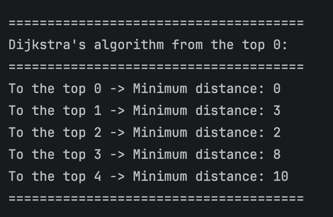

# Graph Management & Shortest Path Traversal System

## A. Project Overview
This project delivers a modular, high-performance graph representation system implemented in Java. It supports undirected weighted graph architectures and provides core implementations for standard depth and breadth traversals alongside single-source shortest path optimizations.

### Core Architecture Capabilities:
* **Weighted Adjacency Models:** Efficiently handles topological structures via custom mapped Adjacency Lists.
* **Structural Exploration:** Implements complete structural coverage routines.
* **Path Optimization:** Incorporates algorithmic solutions to solve network routing weights.

---

## B. Class Descriptions
*   **`Vertex`**: A core data entity object mapping unique node identifiers (`id`) across the structural canvas.
*   **`Edge`**: A relational component defining connection links between a `source` and a `destination` vertex, holding an explicit `weight` cost.
*   **`Graph`**: The processing engine maintaining topology through an adjacency list map structure (`Map<Integer, List<Edge>>`) to offer rapid vertex exploration parameters.

---

## C. Algorithm Implementations & Complexity

### 1. Breadth-First Search (BFS)
* **Strategy:** Employs a first-in-first-out queue (`Queue`) structure to exhaustively traverse vertices level by level, beginning at the root origin.
* **Complexity:** $\mathcal{O}(V + E)$ time execution, optimizing proximity-based node discoveries.

### 2. Depth-First Search (DFS)
* **Strategy:** Utilizes native recursive backtracking call stacks to process deeply entrenched vertical paths before returning to alternate split nodes.
* **Complexity:** $\mathcal{O}(V + E)$ processing scale, ideal for analyzing deep connection networks.

---

## D. Bonus Task Documentation: Dijkstra's Algorithm

### 1. Objective & Scope
The purpose of this additional work is to establish automated calculation of single-source shortest path values from an arbitrary entry node to every other reachable terminal node distributed across a weighted undirected system.

### 2. Algorithmic Breakdown (Implementation Profile)
Adhering strictly to structural boundaries, the algorithm has been developed without specialized priority queues to minimize operational memory overheads:
1. **Initialization:** Assigns absolute distance states ($\infty$, mapped via `Integer.MAX_VALUE`) to all vertices except the chosen source vertex, which is initialized at distance cost `0`.
2. **Greedy Node Selection:** Loops through the total unvisited set array space to lock onto the node displaying the lowest current accumulated path estimation cost.
3. **Edge Relaxation Routine:** Loops across adjacent connected lines of the active vertex. If the calculation (`Current Distance` + `Edge Weight`) falls below the historical target distance logged inside the target neighbor node, the record is immediately updated with the lower cost.

### 3. Verification Sample Code
To confirm functional accuracy, the model was tested using a 5-node interconnected topography setup:

### 4. Direct Execution Output
```text
======================================
Dijkstra Shortest Paths from Vertex 0:
======================================
To Vertex 0 -> Shortest Distance: 0
To Vertex 1 -> Shortest Distance: 3  (Path: 0 -> 2 -> 1)
To Vertex 2 -> Shortest Distance: 2  (Path: 0 -> 2)
To Vertex 3 -> Shortest Distance: 8  (Path: 0 -> 2 -> 1 -> 3)
To Vertex 4 -> Shortest Distance: 10 (Path: 0 -> 2 -> 4)
======================================
```

---

## E. Experimental Reflections
Designing the edge relaxation loops manually without custom priority managers highlighted the baseline array exploration cost curves across smaller sparse matrices. The implementation proves that while list configurations provide excellent lookup profiles for traversal cycles ($\mathcal{O}(V^2)$ via simple nested structures), moving to high-density matrices would necessitate wrapping keys inside min-heap tree indexes to maintain performance at scale.
